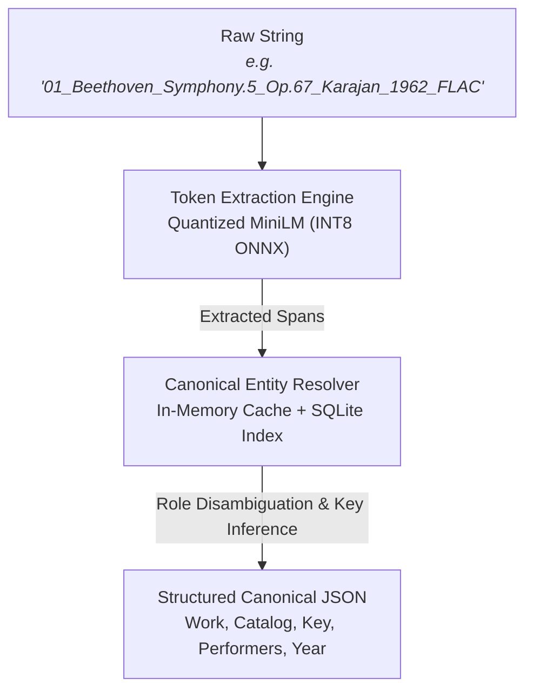

<p align="center">
  
</p>

<h1 align="center">Kochel</h1>

<p align="center">
  Ultra-fast parser & entity linker for messy classical music tracks.
</p>

<p align="center">
  <a href="https://kochel.streamlit.app"></a>
  <a href="https://huggingface.co/spaces/Massi03dev/kochel"></a>
  
  
  
  
</p>

***

**kochel** is an ultra-lightweight, deterministic classical music metadata parser and entity linker.

It extracts chaotic audio tags, messy torrent filenames, and unstructured strings into normalized, catalog-linked structured schemas—running locally on CPU in **~10ms** without external LLMs or heavy dependencies.

---

## ⚡ Quickstart

### Installation

```bash
# Directly from GitHub:
pip install git+https://github.com/Massi03dev/kochel.git

# Or via PyPI (after release):
pip install kochel
```

### Basic Usage

```python
import kochel

# Parse unstructured classical music tags or filenames
track = kochel.parse("Chopin nocturne op 9 no 2 rubinstein rec 1965")

print(track["work"]["canonical_title"])
# -> "Nocturnes"

print(track["work"]["catalog"])
# -> {'prefix': 'Op.', 'number': '9', 'sub_number': '2'}

print(track["recording"]["performers"][0])
# -> {'name': 'Arthur Rubinstein', 'role': 'soloist', 'instrument': 'piano'}
```

---

## 🏛️ Architecture



---

## 🧪 Real-World Stress Tests

Deterministic extraction across noisy real-world naming conventions:

| Raw Input String | Canonical Composer | Canonical Work & Catalog | Inferred Key | Performers & Roles |
| :--- | :--- | :--- | :--- | :--- |
| `01_Beethoven_Symphony.5_Op.67_Karajan_BPO_1962_FLAC` | Ludwig van Beethoven | Symphony no. 5 (Op. 67) | C minor | H. von Karajan (*cond.*), Berliner Phil. (*orch.*) |
| `Mozart KV622 Argerich` | W. A. Mozart | Clarinet Concerto (KV 622) | A major | Martha Argerich (*soloist, piano*) |
| `Bach BWV 1046 Gould` | J. S. Bach | Brandenburg Concerto no. 1 (BWV 1046) | F major | Glenn Gould (*soloist, piano*) |
| `Claudio Abbado Brahms Double Concerto Op 102 Live` | Johannes Brahms | Double Concerto (Op. 102) | A minor | Claudio Abbado (*conductor*) |

---

## 📊 Output Schema

```json
{
  "work": {
    "composer": {
      "raw": "Mozart",
      "canonical": "Wolfgang Amadeus Mozart"
    },
    "canonical_title": "Clarinet Concerto",
    "catalog": {
      "prefix": "KV",
      "number": "622",
      "sub_number": null
    },
    "key": "A major"
  },
  "recording": {
    "year": null,
    "performers": [
      {
        "name": "Martha Argerich",
        "role": "soloist",
        "instrument": "piano"
      }
    ]
  },
  "raw_input": "Mozart KV622 Argerich"
}
```

---

## 🏎️ Performance

- **Inference Latency**: ~10–12 ms per track on standard modern CPU (single thread).
- **RAM Footprint**: < 60 MB (Quantized INT8 ONNX Model + In-Memory Resolver Cache).
- **Zero Cloud Calls**: 100% offline, local and private.

## 📄 License

MIT © Massimiliano